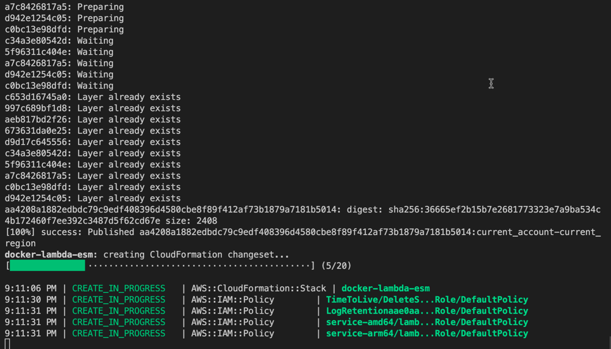
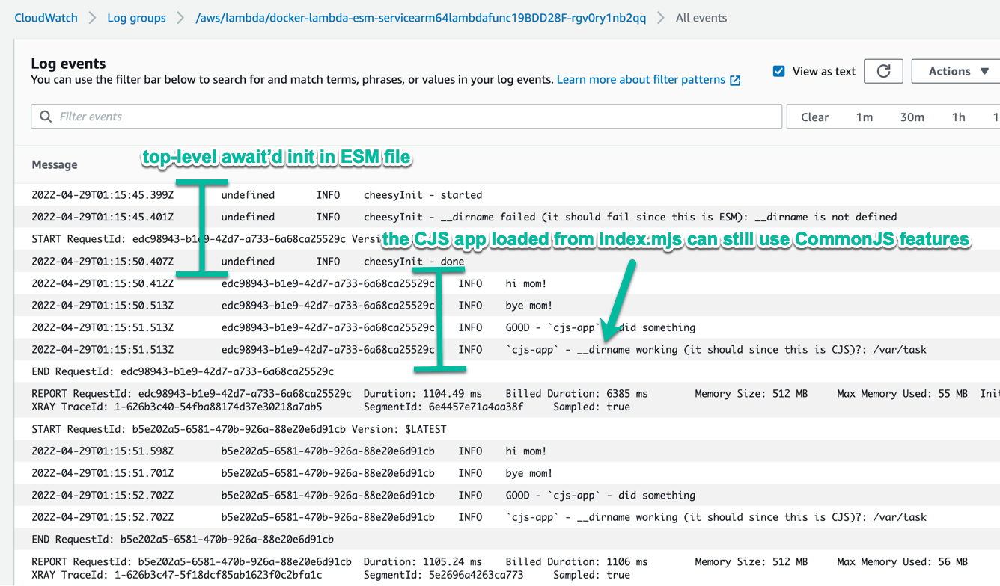

# Overview

Demonstrates how to use an ESM / ES Modules / ES6 Module / `.mjs` entry point for a Docker-based AWS Lambda function using TypeScript / JavaScript.

The [blog post](https://aws.amazon.com/blogs/compute/using-node-js-es-modules-and-top-level-await-in-aws-lambda/) announcing ESM modules in Lambda functions with top-level `await` did not make it clear that this support had landed on Docker-based lambda functions as evidenced by this issue:

[Need nodejs14 es6 module support](https://github.com/aws/aws-lambda-base-images/issues/38)

This example shows that the support does indeed exist within Docker-based Lambda functions.

# Security Notice

The AWS Lambda URLs are configured with security set to `lambda.FunctionUrlAuthType.NONE` so they are open to any caller on the Internet. If this violates your security policies, change the type from `lambda.FunctionUrlAuthType.NONE` to `lambda.FunctionUrlAuthType.AWS_IAM`, then use `awscurl` instead of `curl` to test the function invocation.

[auth type config location](packages/cdk/bin/cdk.ts#L12)

# Usage

```
nvm use
npm i
npm run build
npm run build:rollup
docker-compose build

docker-compose up
# At this point the service should be up but will not be initialized until first request

# To get a shell, if needed, when `docker-compose up` is running:
docker-compose exec app /bin/sh

# To send a test request to the local instance:
npm run test-local-request

# To deploy to an AWS account
npx cdk deploy

# Invoke the Lambda via unsigned URL
npm run test-deployed-request -- [paste the URL here]

# Invoke the Lambda via signed URL
brew install awscurl
cdk-sso-sync [profile-name] # If using `aws sso login`, `awscurl` needs help with SSO-style credentials
npm run test-deployed-request-awscurl -- [paste the URL here]
```

Note that local Docker-based Lambda testing differs from AWS deployed lambda testing in that the local Lambda will not run the init code until the first request is received, even with top-level `await` initialization. The handler file simply will not even be looked for until the first request when running locally, thus no init code can be run until that first request.

## Deploying with CDK



## Logs of Async Init / CJS App within ESM Handler



# Notes

- The ESM build is done by `rollup`
- The module type is set for `rollup` in `rollup.config.js` by the line `format: 'es',`
- The file is not output as `.mjs` so it's renamed from `.js` to `.mjs` in the `Dockerfile`
- It is also possible to copy the `package.json` with `type=module` field into the directory with `index.js`, in which case you can skip the renaming the handler file to `.mjs`
- It's possible to create an `esm` "loader" that handles async init then loads an existing app build with CommonJS, with these as some options:
  - The app can be copied into `/var/task` next to `/var/task/index.mjs` and `/var/task/package.json` can have `type=commonjs` - The `index.mjs` file name will cause the entry point to be treated as ESM even though the `package.json` has `type=commonjs` - The CommonJS "app" will then load fine - The `node_modules` directory used by the app can be placed at `/var/task/node_modules` because the entry point bundles all of it's dependencies using `rollup`
    - This approach is demonstrated in the Dockerfile using the fake app from `packages/cjs-app/`
  - The app can be shoved into a sub-directory with a package.json with `type=commonjs` then imported into `index.ts` - This will cause all other files in the directory with the app to be treated as CommonJS by default
